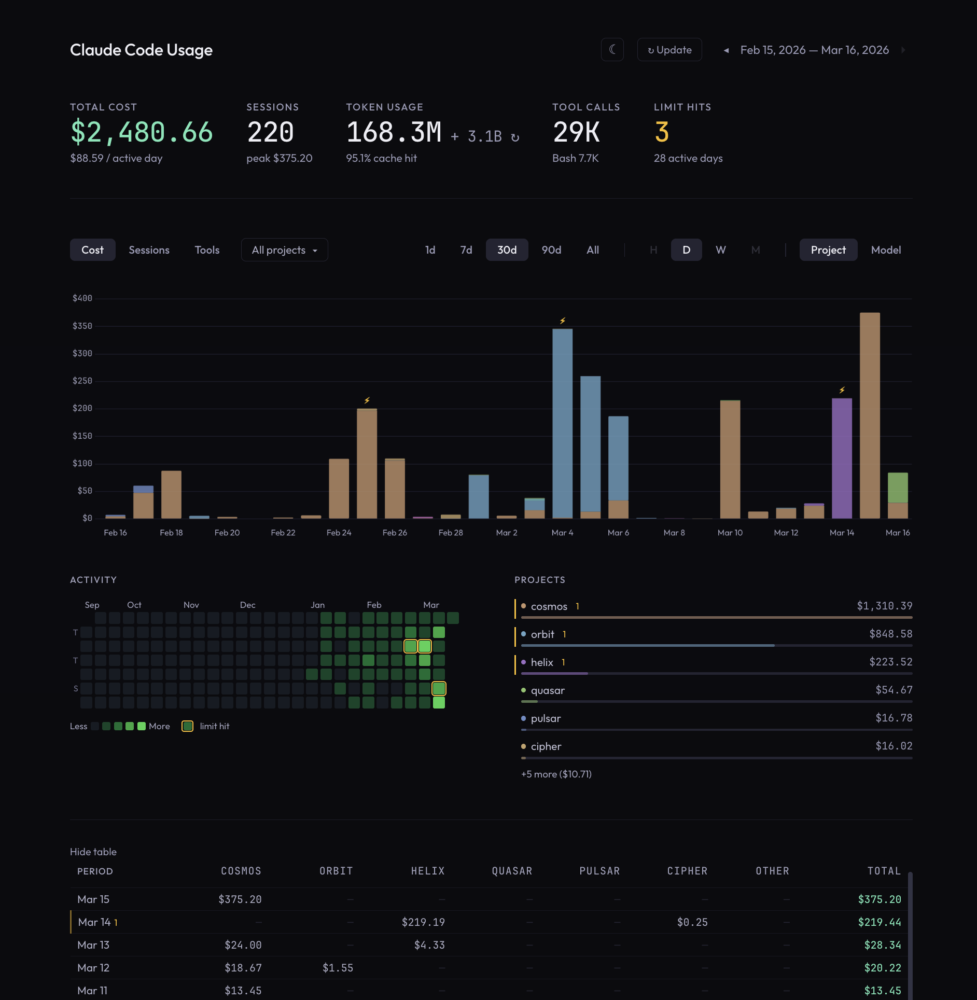

# cc-usage

Local usage dashboard for [Claude Code](https://docs.anthropic.com/en/docs/claude-code) — the AI coding assistant CLI by Anthropic. Parses JSONL session logs stored in `~/.claude/projects` and visualizes API cost, token consumption, sessions, tool calls, and rate limit hits.

  



## Quick start

```bash
python3 server.py
```

Opens `http://localhost:8765` with your dashboard. Click **↻ Update** to refresh data from logs.

### Options

```bash
python3 server.py 9000         # custom port
python3 server.py --no-open    # don't auto-open browser
```

## Docker

```bash
docker build -t cc-usage .

docker run -p 8765:8765 \
  -v ~/.claude/projects:/claude-projects:ro \
  -v cc-usage-data:/app/data \
  cc-usage
```

Then open `http://localhost:8765`.

The named volume keeps `data/usage.json` between container recreations, so warm starts stay fast.

## Features

- **Cost tracking** — per project and per model, with hourly/daily/weekly/monthly granularity
- **Token usage** — input, output, cache read/write breakdown with cache hit rate
- **Tool calls** — per-tool breakdown (Read, Bash, Edit, Grep, Agent, etc.) with top tool highlighted
- **Session analysis** — peak session cost markers on the chart, session count by project
- **Rate limit hits** — detected and deduplicated from `error: rate_limit` entries in logs
- **Activity heatmap** — 6-month calendar with limit hit indicators
- **Timeframe navigation** — 1d, 7d (with hourly granularity), 30d, 90d, All with ← → navigation
- **Stack by project / model** — toggle between project and model breakdown on the chart
- **Dark / light theme** — toggle with automatic persistence to localStorage
- **Project filter** — multi-select dropdown, persisted to localStorage
- **Subagent support** — parses nested subagent session logs
- **Data caching** — extracted data cached in `data/usage.json` for instant page loads

## Supported models

Cost estimates use per-token rates for: Opus 4.6, Opus 4.5, Sonnet 4.6, Sonnet 4.5, Haiku 4.5, Haiku 3.5, and legacy Claude 3 models. Rates are stored in `rates.json` — update the file if Anthropic changes pricing.

## How it works

Reads `~/.claude/projects/*/**.jsonl` and `*/subagents/*.jsonl` session logs. Extracts:
- Token usage and costs from `assistant` messages with `usage` field
- Tool calls from `tool_use` content blocks
- Rate limit events from top-level `error: rate_limit` entries
- Per-session costs by grouping files by parent session UUID

No external dependencies — pure Python stdlib server + vanilla HTML/JS/CSS with a bundled Chart.js asset.

## Security

This dashboard is designed for **local use only**. The server binds to all interfaces (`0.0.0.0`) without authentication — do not expose it to untrusted networks. `CLAUDE_PROJECTS_DIR` should only point to trusted directories.

## Environment variables

| Variable | Default | Description |
|----------|---------|-------------|
| `CLAUDE_PROJECTS_DIR` | `~/.claude/projects` | Path to Claude Code session logs |
| `CC_USAGE_HOME` | `~` | Host home directory (for Docker path stripping) |
| `CC_USAGE_ANON` | `false` | Anonymize project names (for screenshots/demos) |

## Background

This project started as a side effect of exploring what Claude Code stores in its local log files and what useful data can be extracted from them. Turned out to be handy for estimating what the usage would cost at API rates (vs. a Pro/Max subscription) and for tracking rate limit hits to optimize work patterns. Issues and PRs are welcome.
