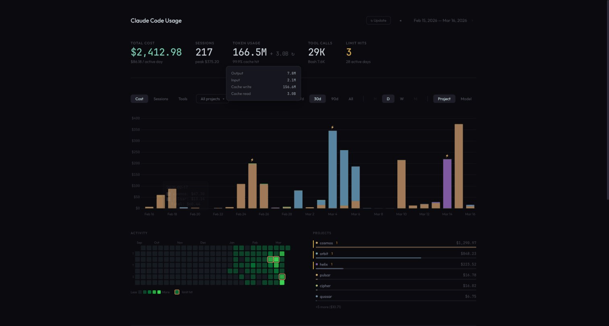

# cc-usage

Local usage dashboard for [Claude Code](https://docs.anthropic.com/en/docs/claude-code) — the AI coding assistant CLI by Anthropic. Tracks API cost, token consumption, sessions, tool calls, and rate limit hits by parsing JSONL session logs. Helps you understand and optimize your Claude Code spending.

  



## Quick start

```bash
python3 server.py
```

Opens `http://localhost:8765` with your dashboard. Click **↻ Update** to refresh data from logs.

### Options

```bash
python3 server.py 9000         # custom port
python3 server.py --no-open    # don't auto-open browser
```

## Docker

```bash
docker build -t cc-usage .

docker run -p 8765:8765 \
  -v ~/.claude/projects:/claude-projects:ro \
  -e CC_USAGE_HOME=$HOME \
  cc-usage
```

Then open `http://localhost:8765`.

## Features

- **Cost tracking** — per project, per model, daily/weekly/monthly/hourly
- **Token usage** — input, output, cache read/write with cache hit rate
- **Tool calls** — which tools (Read, Bash, Edit, etc.) and how often
- **Session analysis** — peak session cost, session count by project
- **Rate limit hits** — detected from `error: rate_limit` in logs
- **Activity heatmap** — GitHub-style 6-month calendar
- **Timeframe navigation** — 1d (hourly), 7d, 30d, 90d, All with ← → navigation
- **Project filter** — dropdown with multi-select, persisted to localStorage
- **Data caching** — extracted data cached in `data/usage.json`, instant page loads

## How it works

Reads `~/.claude/projects/*/**.jsonl` session logs. Extracts:
- Token usage and costs from `assistant` messages with `usage` field
- Tool calls from `tool_use` content blocks
- Rate limit events from top-level `error: rate_limit` entries
- Per-session costs by grouping files by parent session UUID

No external dependencies — pure Python stdlib server + vanilla HTML/JS/CSS with Chart.js from CDN.

## Security

This dashboard is designed for **local use only**. The server binds to all interfaces (`0.0.0.0`) without authentication — do not expose it to untrusted networks. `CLAUDE_PROJECTS_DIR` should only point to trusted directories.

## Environment variables

| Variable | Default | Description |
|----------|---------|-------------|
| `CLAUDE_PROJECTS_DIR` | `~/.claude/projects` | Path to Claude Code session logs |
| `CC_USAGE_HOME` | `~` | Host home directory (for Docker path stripping) |
| `CC_USAGE_ANON` | `false` | Anonymize project names (for screenshots/demos) |

## Disclaimer

This project was built in a couple of hours and tested on macOS only. It may not work correctly on other platforms. Issues and PRs are welcome.
